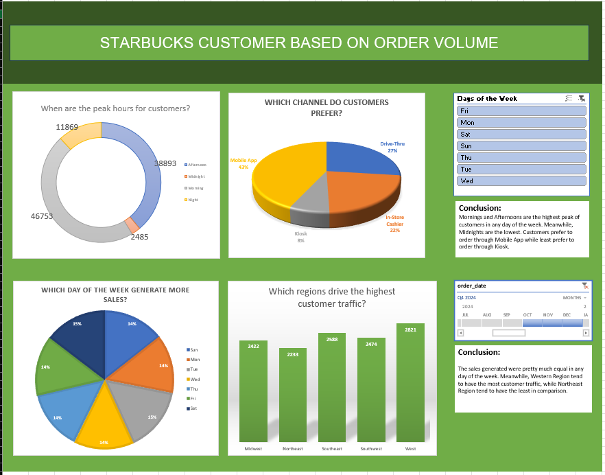
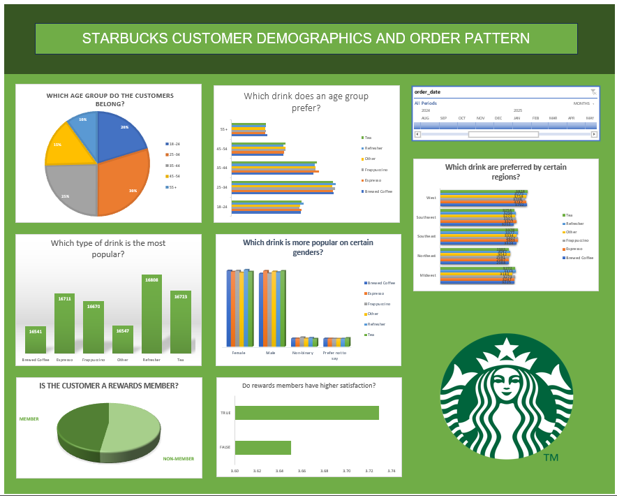

# Starbucks Customer Order Analytics Dashboard

## Project Overview

This project presents an interactive Excel dashboard analyzing customer ordering behavior at Starbucks. The dashboard was developed using Pivot Tables, Pivot Charts, slicers, and KPI metrics to extract meaningful business insights from transactional data.

The goal of this project is to demonstrate data analysis, customer segmentation, and business intelligence reporting using Microsoft Excel.

---

## Dataset Description

The dataset includes customer order information such as:

* Region
* Day of Week
* Time of Day
* Sales Channel
* Age Group
* Gender
* Drink Category
* Rewards Membership
* Customer Satisfaction Rating

---

## Key Analysis Performed

* Regional sales performance comparison
* Order distribution by day of week
* Peak ordering time identification
* Sales channel performance analysis
* Customer segmentation by age group and gender
* Drink preference trends
* Rewards membership behavior analysis
* Customer satisfaction insights

---

## Dashboard Features

* Dynamic Pivot Tables
* Interactive Slicers
* Pivot Charts for visual insights
* KPI summary metrics
* Clean and structured dashboard layout

---

## Tools & Skills Demonstrated

* Microsoft Excel
* Pivot Tables & Pivot Charts
* Data Cleaning & Aggregation
* Interactive Dashboard Design
* Business Insight Generation
* Data Visualization

---

## 💡 Business Insights Generated

* Identified peak customer activity periods
* Compared regional performance trends
* Analyzed purchasing behavior across demographics
* Evaluated the impact of rewards membership on orders
* Highlighted satisfaction trends for improvement opportunities

---

## Dashboard Preview


```markdown


```

---

## How to Use

1. Download the Excel file from this repository
2. Open in Microsoft Excel
3. Use slicers to interact with the dashboard
4. Explore insights across different dimensions

---

## Project Purpose

This project was created as part of my data analytics portfolio to showcase practical Excel-based business intelligence skills and dashboard development capabilities.

